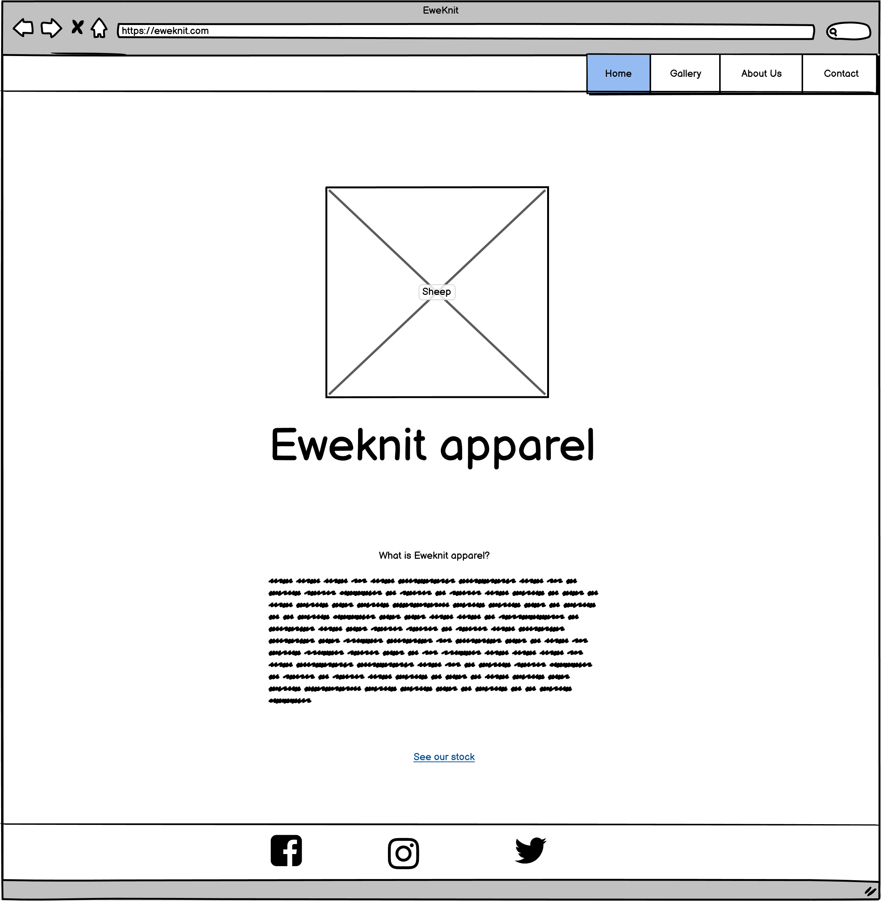
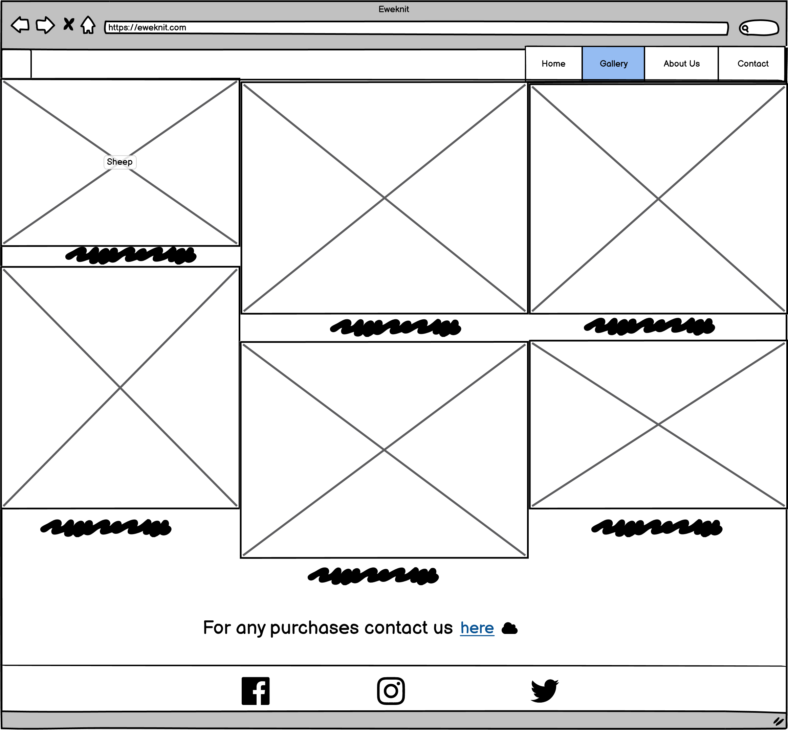
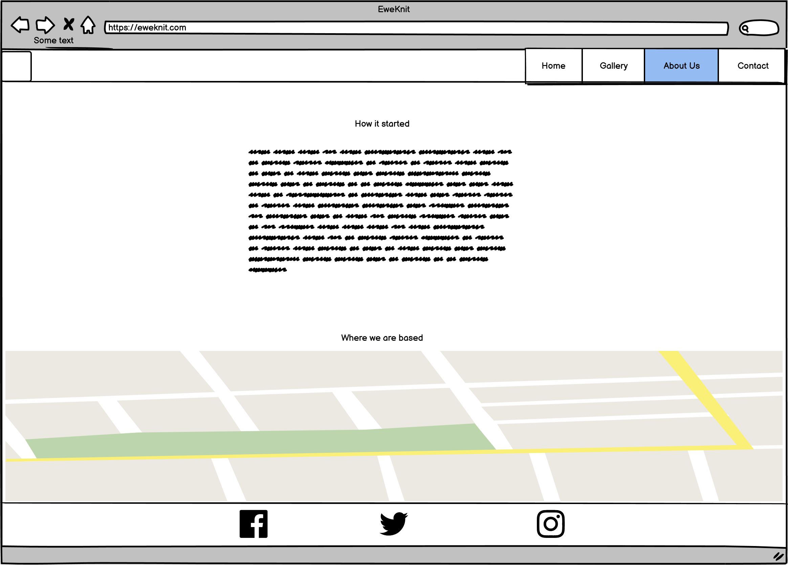
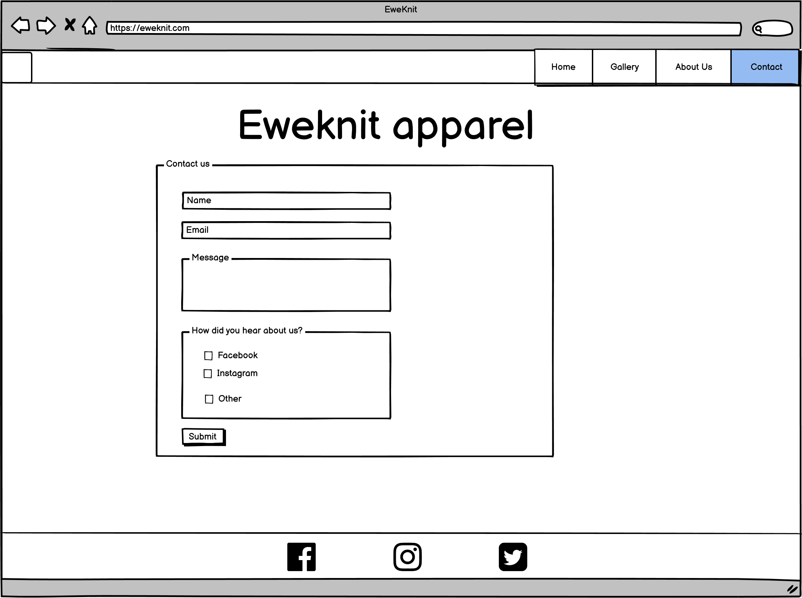
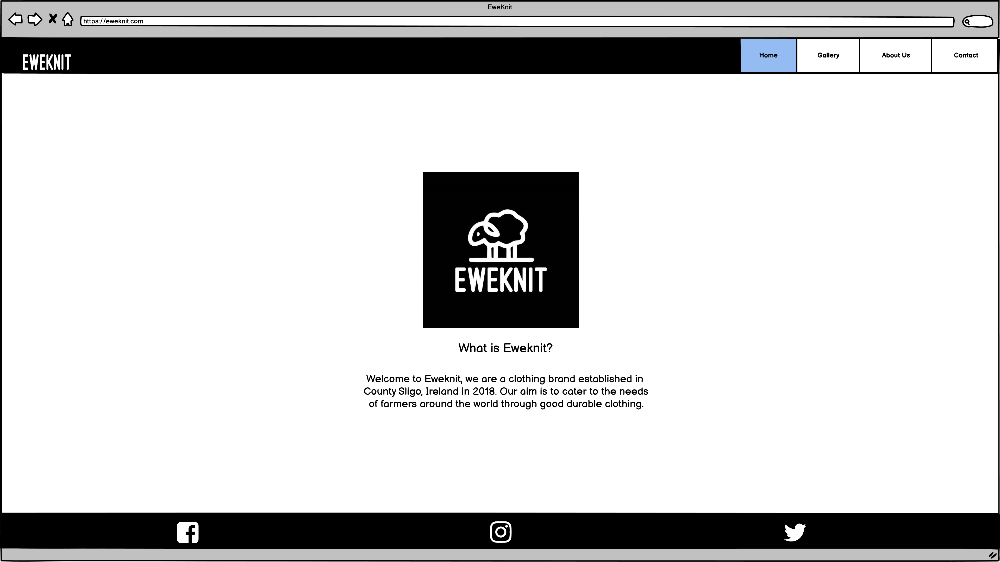
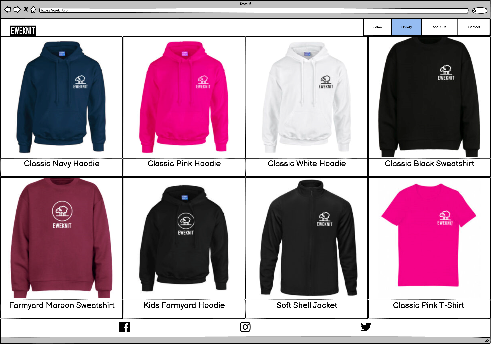
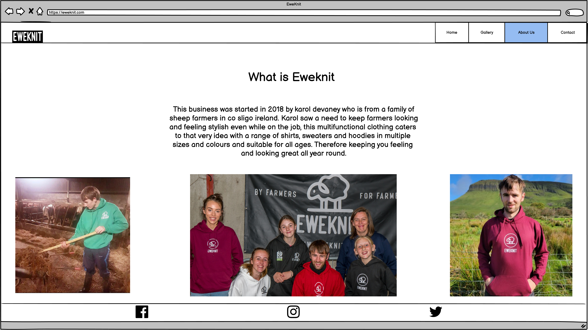
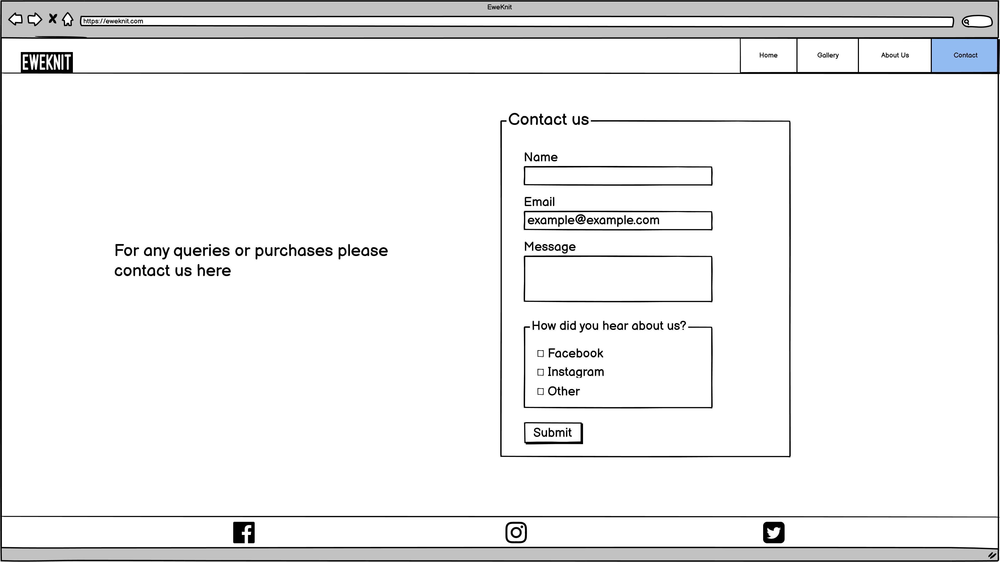
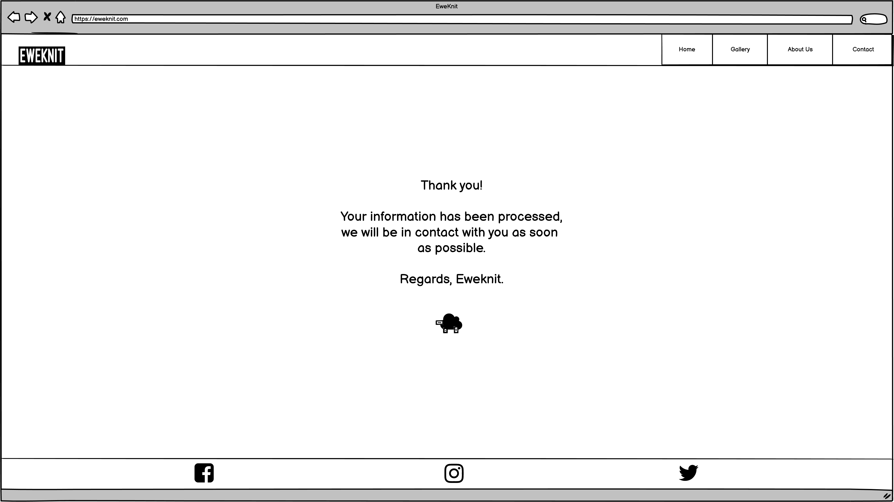

*This project was started on the 15/11/2021. My deadline was the 30/11/2021.*

# Project History up to the 18/11/2021
I got the idea for my project from my brother Karol who runs an ecommerce clothing brand called Eweknit. He was joking me quite often that I could build a webside for him. I decided that I would ask my mentor Rohit if I could base my project on Karols brand with his permission. After I recived Karols permission I then went and created Project V1 in Balsamiq Wireframes to present to my mentor. 
 
This project included 4 pages, index.html (The home page), gallery.html, about.html and contact.html. 
 
<!-- Project V1 Balsamiq wireframes -->

 
*Order of images: index.html, gallery.html, about.html, contact.html* 
 
My mentor told me that it was ok to use Karols brand, sugested I prepare all my text and images before I begin coding and sugested improvements for user experience. 
These improvements that he sugested included removing the *See our stock* link at the bottom of the index.html page and the *For any purchases contact us here* link at the bottom of gallery.html page because I will have the navigation bar fixed to the top of the page even when scrolling using CSS. He also sugested giving the user interaction feedback through the *Submit* button on the contact.html page so I created the redirect page and I will set it to redirect to that page when it is pressed. I will also have it invert the background and text colors when it is pressed using CSS. 
 
Lastly, I gathered together all the images I would use for my project, simplified some of the pages and optimised the wire frames for screens 1920x1080px, the resolution of my own monitor. 
 
<!-- Project V2 Balsamiq wireframes -->

 
*Order of images: index.html, gallery.html, about.html, contact.html, submit-redirect.html* 
 
I saved this again but as Project V2 so I could have both Project V1 and Project V2 for historical refrence.