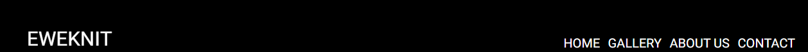

# Eweknit
## Website purpose
The Eweknit website is a place on the web for people who wish to learn more about or contact Eweknit in regards their clothing stock.  
Users of the site will be able to learn more about the brand, view the stock and get in contact if they wish to do so.  
The site is target towards farmers around the world who are passionate about farming and want to be comfortable and stylish while on the job.  
 

***

## Features
***
### Navigation
+ In the header there is the left-hand logo that is clickable to return you to the homepage
+ There is also nav links on the right of the header to the diffrent pages of the site
+ In the footer there is also social media links to the different social media platforms that eweknit is present on
Header

Footer

***

### The Homepage
+ The home page has a circlur Logo followed by a breif description of the brand

***

### The Gallery page
+ This page showcases the stock that Eweknit has for sale

***

### The About us page
+ This page give the background story of the brand Eweknit

***

### The Contact page
+ This page allows the the user to contact Eweknit

***

### The Submit Redirect page
+ The user is redirected to this page when they have filled out the form

***

## Testing
***
I made the page responsive using Chromes devtools, 5 Media queries and the website Am I responsive: http://ami.responsivedesign.is.
I tested the header logo, the nav links and the footer social media icons to make sure they work, I also made the form require a name and an email or else the form would not submit and tested this also.

### Valadator testing
+ I ran my HTML though the W3C validator and it returned no Errors
+ I ran my CSS through the offical (Jigsaw) validator and it returned no errors
### Accessibility
+ I got a 98% grade when i ran my code through Lighthouse in devtools

## Deployment
+ The site was deployed to GitHub pages. The steps to deploy are as follows:
    + In the GitHub repository, navigate to the Settings tab
    + From the source section drop-down menu, select the Master Branch
    + Once the master branch has been selected, the page provided the link to the completed website.

## Credits
+ The logo and color scheme were taken from Eweknit with permission
Media
• The layout for the README was taken from https://learn.codeinstitute.net/ example README